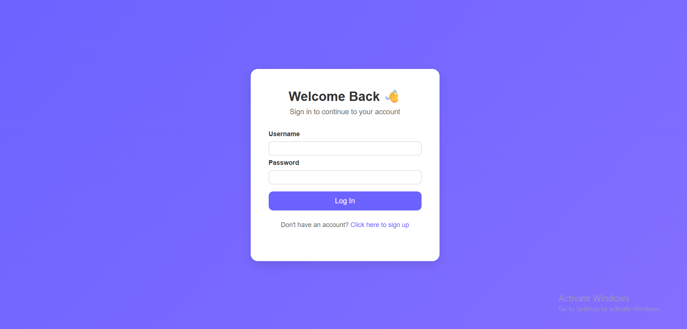
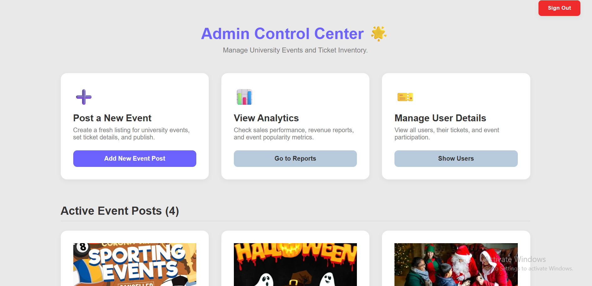
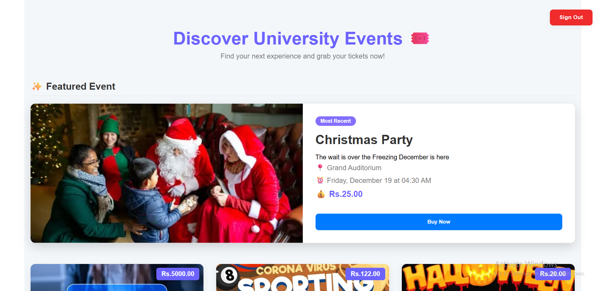

# 🎟️ BookMe – University Ticket Booking System

**BookMe** is a web-based event and ticket booking platform designed for university students and administrators.  
It simplifies  ticket booking and reporting providing a smooth experience for both users and admins.

---

## 🚀 Features
- Send the Ticket (Qrcode) through a mail

### 👩‍🎓 User Features
- Browse and view upcoming university events  
- Book tickets online (with seat limits and availability tracking)  
- Secure login and profile access  

### 🧑‍💼 Admin Features
- Post and manage events (add, edit)  
- Manage users 
- Update event details 
---

## ⚙️ Tech Stack

| Layer | Technology |
|-------|-------------|
| **Frontend** | React + SASS/SCSS + TypeScript |
| **Backend** | Spring Boot (Java 17) |
| **Database** | MongoDB |
|**Database Connectivity**| Ajax Requsets |
| **Authentication** | JWT Token & Refresh Token |
| **Build Tool** | Maven |
| **Version Control** | Git & GitHub |

---

## 📸 Screenshots 





## 🏗️ System Architecture
```
React (Frontend)
↓
Spring Boot REST API (Backend)
↓
MongoDB Database
```

- The system follows a **RESTful** architecture.  
- **JWT tokens** ensure secure, role-based access for Admin and User roles.  
- **Axios** is used for frontend API communication.  

---

## 📂 Project Structure

### 🖥️ Frontend
```
BookMe-Frontend/
├── src/
│ ├── components/
│ ├── pages/
│ ├── services/
│ ├── styles/
│ └── App.tsx
└── package.json
```

### ⚙️ Backend
```
BookMe-Backend/
├── src/
│ ├── main/java/com/bookme/
│ │ ├── controller/
│ │ ├── service/
│ │ ├── repository/
│ │ └── model/
│ └── resources/
│ └── application.properties
└── pom.xml
```

---

## 💻 How to Run Locally

### 🧩 Prerequisites
- Node.js (v18 or above)
- Java JDK 17+
- MongoDB 
- Maven

### 🪄 Setup Steps

1. **Clone the repository**
   ```bash
    git clone https://github.com/DiilaNa/BookMe.git
    cd BookMe
   ``` 
2. **Setup the frontend**  
```  
    cd backend
    mvn clean install
    mvn spring-boot:run
```
   - The backend will run on: http://localhost:8080

3. **Setup the frontend**
```
    cd frontend
    npm install
    npm run dev
```
- The frontend will run on: http://localhost:5173

### 🔐 Authentication

- JWT tokens are used for authentication and authorization.
- Users log in using credentials → receive a token → access restricted routes.
- Admins have access to management endpoints (/admin/*).

### 📊 Future Enhancements
- 📈 Advanced Analytics Dashboard

## 👨‍💻 Author

- Dilan Liyanaarachchi 📧 [Email Me](mailto:liyanaarachchidilan@gmail.com)   🔗 [LinkedIn](www.linkedin.com/in/dilan-liyanaarachchi-8a0a01244)  
- 📚 Graduate Diploma in Software Engineering (IJSE)

### 📝 License

- This project is created for educational purposes.
- Feel free to explore and modify for learning use.
